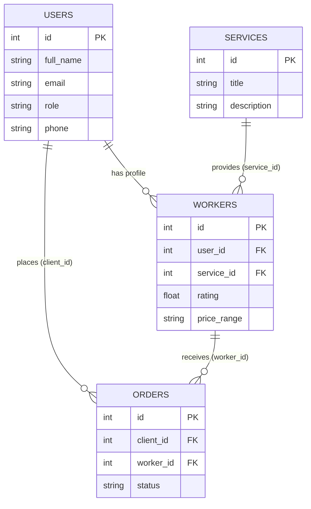

# Практикалық жұмыс №3
**Тақырыбы:** Модельдерді, пішіндерді және мәліметтер базасын құру
**Жоба:** Жергілікті қызмет табу платформасы (SheberTab)

---

## 1. Мәліметтер базасын жобалау

Жобада келесі негізгі кестелер мен олардың атрибуттары қарастырылған:

### 1.1 `users` (Пайдаланушылар) кестесі
Бұл кесте жүйеге тіркелген барлық клиенттер мен мамандарды сақтайды.
* `id` (INTEGER, PRIMARY KEY) – Пайдаланушының бірегей идентификаторы.
* `full_name` (VARCHAR) – Пайдаланушының толық аты-жөні.
* `email` (VARCHAR, UNIQUE) – Электрондық поштасы (логин ретінде қолданылады).
* `password_hash` (TEXT) – Құпия сөздің шифрланған нұсқасы.
* `role` (VARCHAR) – Пайдаланушының рөлі (`client` немесе `worker`).
* `phone` (VARCHAR) – Байланыс телефоны.

### 1.2 `services` (Қызмет түрлері) кестесі
Жүйеде ұсынылатын барлық қызмет санаттарын сақтайды.
* `id` (INTEGER, PRIMARY KEY) – Қызмет түрінің бірегей идентификаторы.
* `title` (VARCHAR) – Қызмет атауы (мысалы, "Электрик", "Сантехник").
* `description` (TEXT) – Қызметтің толық сипаттамасы.

### 1.3 `workers` (Мамандар) кестесі
Пайдаланушылар арасынан "маман" ретінде тіркелгендердің қосымша мәліметтерін сақтайды.
* `id` (INTEGER, PRIMARY KEY) – Маман профилінің бірегей идентификаторы.
* `user_id` (INTEGER, FOREIGN KEY) – `users` кестесіне сілтеме (маманның жеке деректері).
* `service_id` (INTEGER, FOREIGN KEY) – `services` кестесіне сілтеме (қандай қызмет көрсетеді).
* `rating` (NUMERIC) – Маманның орташа бағалау көрсеткіші.
* `price_range` (VARCHAR) – Қызметінің бағасы.
* `average_time` (VARCHAR) – Орташа жұмыс уақыты.

### 1.4 `orders` (Тапсырыстар) кестесі
Клиент пен маман арасындағы келісімдерді (тапсырыстарды) сақтайды.
* `id` (INTEGER, PRIMARY KEY) – Тапсырыстың бірегей идентификаторы.
* `client_id` (INTEGER, FOREIGN KEY) – `users` кестесіне сілтеме (Тапсырыс беруші).
* `worker_id` (INTEGER, FOREIGN KEY) – `workers` кестесіне сілтеме (Тапсырыс қабылдаушы).
* `status` (VARCHAR) – Тапсырыс күйі (`pending`, `accepted`, `completed`).

---

## 2. Мәліметтер арасындағы байланыстар (ER Диаграмма)

Дерекқордағы кестелер бір-бірімен **Foreign Key (Сыртқы кілт)** арқылы тығыз байланысқан:
* **`users` -> `workers` (1:1 немесе 1:N):** Бір пайдаланушы бір маман профиліне ие бола алады. `workers.user_id` кілті `users.id` кілтіне сілтейді.
* **`services` -> `workers` (1:N):** Бір қызмет түрін (мысалы, Сантехник) бірнеше маман көрсете алады. `workers.service_id` кілті `services.id` кілтіне сілтейді.
* **`users` -> `orders` (1:N):** Бір клиент бірнеше тапсырыс бере алады. `orders.client_id` кілті `users.id` кілтіне сілтейді.
* **`workers` -> `orders` (1:N):** Бір маман бірнеше тапсырыс қабылдай алады. `orders.worker_id` кілті `workers.id` кілтіне сілтейді.

---

## 3. Пайдаланушы интерфейсінің пішіндері (Forms)

Платформадағы негізгі бизнес-логиканы жүзеге асыру үшін келесі пішіндер (формалар) жасалған:

### 3.1 Қызмет таңдау және іздеу формасы
Бұл форма клиенттерге қажетті маманды табуға көмектеседі.
* **Өрістері:** 
  * `Іздеу жолағы (Search input)` - Маманның аты бойынша іздеу.
  * `Санаттар тізімі (Dropdown/Select)` - "Электрик", "Сантехник" сияқты қызмет түрлерін сүзу (фильтр).
* **Логикасы:** Клиент сүзгіні таңдаған кезде жүйе дерекқордан (`workers` + `services` JOIN арқылы) сәйкес келетін мамандар тізімін шығарады. Тізімнен маманды таңдап, "Тапсырыс беру" түймесін басады.

### 3.2 Маманды тіркеу формасы
Кез келген пайдаланушы өзін маман ретінде тіркей алады.
* **Өрістері:**
  * `Қызмет түрі (Select)` - Қандай қызмет көрсететінін таңдау (мәліметтер `services` кестесінен алынады).
  * `Бағасы (Input)` - Қызметінің бастапқы құны (мысалы, "5000 тг-ден бастап").
* **Логикасы:** Пайдаланушы форманы толтырып жібергенде, оның `users.id` мәні мен таңдаған `service_id` мәні біріктіріліп, `workers` кестесіне жаңа қатар болып қосылады. Бұл кезде пайдаланушының рөлі автоматты түрде `worker` болып өзгереді.

### 3.3 Қызметті бағалау және тапсырыс статусы формасы
Жеке кабинетте (Profile) орналасқан пішін.
* **Өрістері:**
  * `Тапсырыстар тізімі` - Клиенттің берген тапсырыстары немесе Маманның қабылдаған тапсырыстары (`orders` кестесі).
  * `Статусты өзгерту түймелері` - "Қабылдау", "Аяқтау", "Бас тарту".
  * `Бағалау (Rating)` - Жұмыс аяқталған соң маманға 1-ден 5-ке дейін жұлдызша қою.
* **Логикасы:** "Аяқтау" түймесі басылған кезде `orders` кестесіндегі тапсырыс күйі `completed` болып өзгереді, ал клиент қойған баға `workers` кестесіндегі маманның `rating` бағанына қосылып, орташа баға қайта есептеледі.
